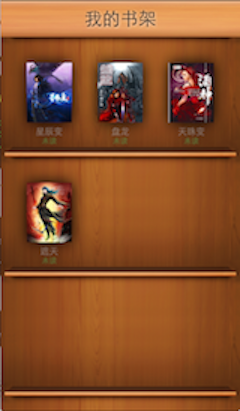
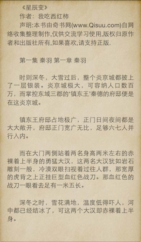
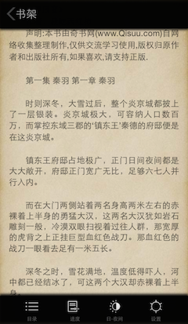

BReader
=======

iPhone 上的小说阅读器。

软件截图：
---

 
 

NOTE:
---
>初学 Object-C, 代码质量不高见谅！

>已实现基本的阅读功能，菜单目录、进度和设置暂未实现

LICENSE
---

Copyright (C) 2014 Ruikye's open source project

Licensed under the Apache License, Version 2.0 (the "License");
you may not use this file except in compliance with the License.
You may obtain a copy of the License at

http://www.apache.org/licenses/LICENSE-2.0

Unless required by applicable law or agreed to in writing, software
distributed under the License is distributed on an "AS IS" BASIS,
WITHOUT WARRANTIES OR CONDITIONS OF ANY KIND, either
express or implied. See the License for the specific language 
governing permissions and limitations under the License.